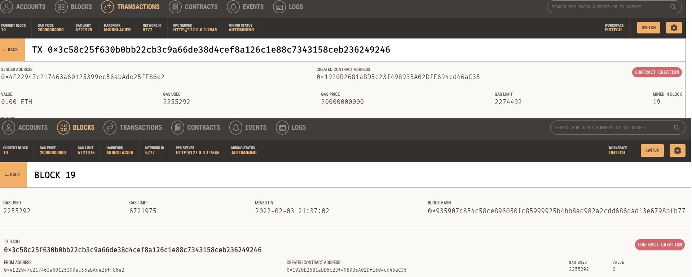
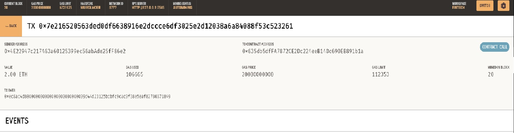
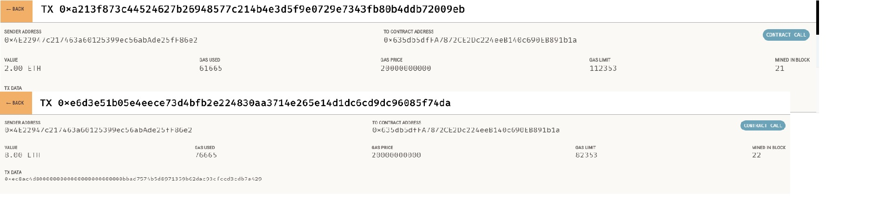
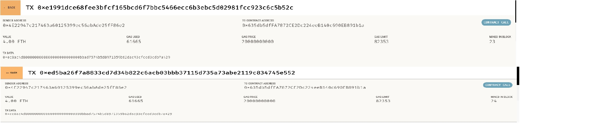
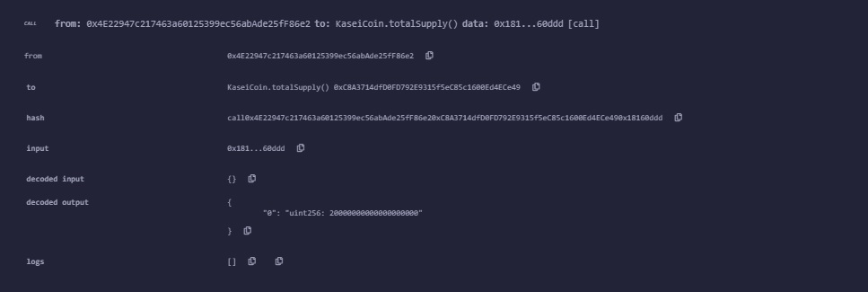

## Create Contract for KaseiCoin

*you can find the screenshot of the output of compilation of the contract below*

## instatiate a crowdsale KaseiCoin token

*you can find the successful compilation of the contract below*

## Compile Deployed Crowdsale KaseiCoin

*you can find the deployed compilation for instatiating the crowdsale KaseiCoin*

## Ganache transactions

*Please find the ganache transaction for the deployed crowdsale contract*

## KaseiCoin Purchases

*first purchase*

*second and third purchases*

*fourth and fifth purchases*

## Total Supply

*we can see an increase in total supply*

